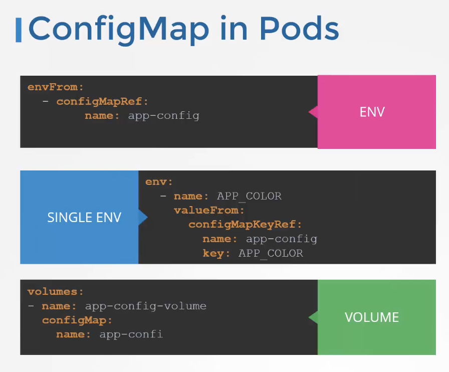

K8s

-------------********************---------*****************************-------********************------------------
				    UDEMY
-------------********************---------*****************************-------********************------------------
Certification Tips
Make sure you check out these tips and tricks from other students who have cleared the exam:

https://www.linkedin.com/pulse/my-ckad-exam-experience-atharva-chauthaiwale/

https://medium.com/@harioverhere/ckad-certified-kubernetes-application-developer-my-journey-3afb0901014

https://github.com/lucassha/CKAD-resources
-------------********************---------*****************************-------********************------------------


Docker and K8s
# Docker commands
docker run --name webapp-color -d 25361732f280
docker run -d --name webapp-container -p 8282:8080 webapp-color
docker exec -it webapp-container /bin/bash
docker build -t name:latest .
docker ps
docker images

docker run --name ubuntu-sleeper ubuntu-sleeper 10 # to append the value in Entrypoint.
dokcer run --name ubuntu-sleeper --entrypoint sleep2.0 ubuntu-sleeper 10 # To change the entrypoint value
```shell
FROM ubuntu
Entrypoint ["sleep"]
CMD ["10"]
```

kubectl run webapp-green --image=kodecloud/webapp-color -- --color green
# To run commands inside a running pod
**kubectl exec -it <pod-name> -- /bin/bash**
-------------********************---------*****************************-------********************------------------
Namespaces
# To check the services in the namespace which is `kube-system` here
kubectl get pods svc -n kube-system
# This next command creates a new pod and new service.
kubectl run httpd --image=httpd:alpine --port=80 --expose=true
-------------********************---------*****************************-------********************------------------
For more details, refer:
https://kubernetes.io/docs/reference/kubectl/overview/
https://kubernetes.io/docs/reference/kubectl/cheatsheet/
-------------********************---------*****************************-------********************------------------
kubectl create -f replicaset-definition.yaml
kubectl get replicaset
kubectl describe replicaset myapp-replicaset
kubectl delete replicaset myapp-replicaset
# This is used when we have to update the number of replicas
kubectl replace -f replicaset-definition.yaml
# This is used when we have to update the number of replicas, but it won't update the yaml file.
kubectl scale --replicas=6 -f replicaset-definition.yaml

Kubectl get all
-------------********************---------*****************************-------********************------------------


Ready in kubectl get pods
running containers and total containers

kubectl create deployment app1 --image=nginx

kubectl get pods

kubectl describe pod

kubectl delete pod webapp

cat pod-definition.yaml
```yaml
apiVersion: v1
kind: Pod
metadata:
  name: redis
  labels:
    app: redis-app
spec:
  containers:
    - name: redis
      image: redis123
```
kubectl run nginx --image=nginx

-------------********************---------*****************************-------********************------------------

Argo CD
https://www.youtube.com/watch?v=MeU5_k9ssrs

https://www.youtube.com/watch?v=HGu9sgoHaJ0

https://www.youtube.com/watch?v=EQNO_kM96Mo
https://gitlab.com/nanuchi/youtube-tutorial-series/-/tree/master/demo-kubernetes-components

https://kubernetes.io/docs/tutorials/hello-minikube/
https://minikube.sigs.k8s.io/docs/start/
https://www.youtube.com/results?search_query=learn+kubernetes
https://www.youtube.com/watch?v=rBeyHDKLVqM
https://hub.docker.com/

https://www.youtube.com/watch?v=QJ4fODH6DXI&list=PL2We04F3Y_43dAehLMT5GxJhtk3mJtkl5

App Name = my-test-app1

$ minikube start/delete
$ minikube status
$ minikube dashboard

$ kubectl delete deployment my-test-app1
$ Kubectl describe pods
$ kubectl logs my-test-app1

# to run dockerfile
$ docker build -t docker-hub/img:tag ./

$ docker login
$ docker push docker-hub/img:newTag

# Create deployment
kubectl create deployment my-test-app1 --image=nginx:latest

$ kubectl create deployment my-test-app1 --image=nginx:latest 
deployment.apps/my-test-app1 created

$ kubectl get deployment 
NAME           READY   UP-TO-DATE   AVAILABLE   AGE
my-test-app1   0/1     1            0           61s

$ kubectl get pods
NAME                            READY   STATUS              RESTARTS   AGE
my-test-app1-6c7bf86469-pfwn9   0/1     ContainerCreating   0          67s

$ kubectl get services
NAME         TYPE        CLUSTER-IP   EXTERNAL-IP   PORT(S)   AGE
kubernetes   ClusterIP   10.96.0.1    <none>        443/TCP   138m

$ kubectl expose deployment my-test-app1 --port=80 --type=LoadBalancer
service/my-test-app1 exposed

$ kubectl get services
NAME           TYPE           CLUSTER-IP       EXTERNAL-IP   PORT(S)        AGE
kubernetes     ClusterIP      10.96.0.1        <none>        443/TCP        139m
my-test-app1   LoadBalancer   10.104.215.137   <pending>     80:31350/TCP   3s

$ minikube service my-test-app1
|-----------|--------------|-------------|---------------------------|
| NAMESPACE |     NAME     | TARGET PORT |            URL            |
|-----------|--------------|-------------|---------------------------|
| default   | my-test-app1 |          80 | http://192.168.49.2:31350 |
|-----------|--------------|-------------|---------------------------|
🏃  Starting tunnel for service my-test-app1.
|-----------|--------------|-------------|------------------------|
| NAMESPACE |     NAME     | TARGET PORT |          URL           |
|-----------|--------------|-------------|------------------------|
| default   | my-test-app1 |             | http://127.0.0.1:60024 |
|-----------|--------------|-------------|------------------------|
🎉  Opening service default/my-test-app1 in default browser...
❗  Because you are using a Docker driver on darwin, the terminal needs to be open to run it.
^C
✋  Stopping tunnel for service my-test-app1.

$ kubectl delete deployment my-test-app1
deployment.apps "my-test-app1" deleted


# Changes in running K8s app

$ kubectl set image deployment my-test-app1 ContainerName=docker-hub/img:newTag


# to check the details in single lines
$ kubectl get pods -o wide

# This will give an output of yaml to create redis with redis123 image
$ kubectl run redis --image=redis123 --dry-run=client -o yaml > redis.yaml


Link: https://uklabs.kodekloud.com/courses/labs-certified-kubernetes-administrator-with-practice-tests/

# To make correction to already created pod, Edit the -f file and then hit:
$ kubectl apply -f redis.yaml

-------------********************---------*****************************-------********************------------------
A Note on Editing Existing Pods
In any of the practical quizzes, if you are asked to edit an existing POD, please note the following:  
	•	If you are given a pod definition file, edit that file and use it to create a new pod.  
	•	If you are not given a pod definition file, you may extract the definition to a file using the below command:
kubectl get pod <pod-name> -o yaml > pod-definition.yaml
Then edit the file to make the necessary changes, delete, and re-create the pod.  
	•	To modify the properties of the pod, you can utilize the kubectl edit pod <pod-name> command. Please note that only the properties listed below are editable.  
	•	spec.containers[*].image  
	•	spec.initContainers[*].image  
	•	spec.activeDeadlineSeconds  
	•	spec.tolerations  
	•	spec.terminationGracePeriodSeconds  
-------------********************---------*****************************-------********************------------------
Environment Variables
```shell
kubectl create app-config myapp-config \
	--from-literal=KEY_APP=VALUE_APP \
	--from-literal=KEY_APP2=VALUE_APP2

kubectl create app-config myapp-config \
	--from-file=./app-config.properties
	env:
	  valueFrom:
	    configMapKeyRef:
	      name: webapp-config-map
		  key: APP_COLOR
```

-------------********************---------*****************************-------********************------------------
Secrets
```shell
Kubectl create secret generic myapp-secret \
	--from-literal=APP_COLOR=red \
	--from-literal=APP_PASSWORD=mysecretpassword
Kubectl create secret generic myapp-secret \
	--from-file=./app-secret.properties
```
Write the data in app-secret.properties file
```properties
APP_COLOR=red
APP_PASSWORD=mysecretpassword
```


# to create encoded value for text
echo -n "mysecretpassword" | base64
# to decode the value
echo -n "bXlzZWNyZXRwYXNzd29yZA==" | base64 --decode
# ENV
envFrom:
  - secretRef:
	  name: myapp-secret
# Single ENV
env:
  - name: APP_COLOR
	valueFrom:
	  secretKeyRef:
		name: myapp-secret
		key: APP_COLOR
# Volumes (It autmatically creates a file for every secret)
volumes:
  - name: myapp-secret-volume
	secret:
	  secretName: myapp-secret
Note:
  - Secrets are not encrypted, only encoded
  - 
-------------********************---------*****************************-------********************------------------
**Service Accounts in K8s**
User Level and Service Level
Kubectl create serviceaccount myservice-account

controlplane ~ ➜ cat /var/rbac/
dashboard-sa-role-binding.yaml  pod-reader-role.yaml            

controlplane ~ ➜ cat /var/rbac/dashboard-sa-role-binding.yaml 
```yaml
---
kind: RoleBinding
apiVersion: rbac.authorization.k8s.io/v1
metadata:
  name: read-pods
  namespace: default
subjects:
- kind: ServiceAccount
  name: dashboard-sa # Name is case sensitive
  namespace: default
roleRef:
  kind: Role #this must be Role or ClusterRole
  name: pod-reader # this must match the name of the Role or ClusterRole you wish to bind to
  apiGroup: rbac.authorization.k8s.io
```

controlplane ~ ➜  cat /var/rbac/pod-reader-role.yaml 
```yaml
---
kind: Role
apiVersion: rbac.authorization.k8s.io/v1
metadata:
  namespace: default
  name: pod-reader
rules:
- apiGroups:
  - ''
  resources:
  - pods
  verbs:
  - get
  - watch
  - list
```
This is how we add an already created service account to a pod/deployment.
```yaml
spec:
      serviceAccountName: my-service-account  # <-- Add this line
      containers:
        - name: my-app-container
          image: my-app-image:latest
          ports:
```
-------------********************---------*****************************-------********************------------------
Resource Requirements
-------------********************---------*****************************-------********************------------------
Taints and Toleration
kubectl taint nodes node-name key=value=taint-effect
# To untaint the node (add the - to the end)
```shell
controlplane ~ ➜  kubectl describe nodes controlplane | grep Taints
Taints:             node-role.kubernetes.io/control-plane:NoSchedule
controlplane ~ ➜ kubectl taint nodes controlplane node-role.kubernetes.io/control-plane:NoSchedule-
node/controlplane untainted
```
Three taint-effects: NoSchedule | PreferNoSchedule | NoExecute
Example:
Kubectl taint nodes node1 app=blue:NoSchedule
# To check the Master Node
kubectl describe node master-name | grep Taints
kubectl get pods -o wide
-------------********************---------*****************************-------********************------------------
Node Selector
# Add label to the node
kubectl label nodes node-name label-key=label-value
kubectl label nodes node01 size=large
kubectl get nodes node01 --show-labels
Node Affinity
Types:
Available: requiredDuringSchedulingIgnoredDuringExecution | preferredDuringSchedulingIgnoredDuringExecution |
Planned: requiredDuringSchedulingRequiredDuringExecution


