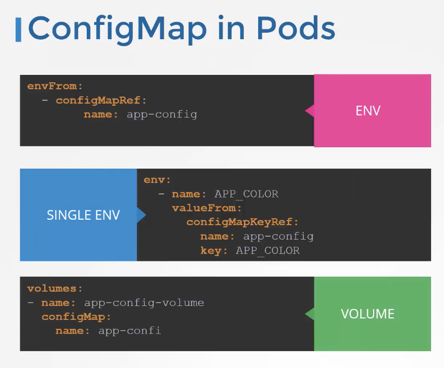

# Kubernetes (K8s) Examples and Resources

This repository contains various Kubernetes examples and resources to help you understand and work with Kubernetes effectively.

---

## Certification Tips

Make sure to check out these tips and tricks from other students who have cleared the CKAD exam:

- [My CKAD Exam Experience - Atharva Chauthaiwale](https://www.linkedin.com/pulse/my-ckad-exam-experience-atharva-chauthaiwale/)
- [CKAD Journey - Harioverhere](https://medium.com/@harioverhere/ckad-certified-kubernetes-application-developer-my-journey-3afb0901014)
- [CKAD Resources - GitHub](https://github.com/lucassha/CKAD-resources)

---

## Docker and Kubernetes Commands

### Docker Commands
- `docker run --name webapp-color -d 25361732f280`
- `docker build -t name:latest .`
- `docker ps`
- `docker images`

### Kubernetes Commands
- `kubectl run webapp-green --image=kodecloud/webapp-color -- --color green`
- `kubectl exec -it <pod-name> -- /bin/bash`
- `kubectl get pods -n kube-system`
- `kubectl create -f replicaset-definition.yaml`

For more details, refer to:
- [Kubernetes Kubectl Overview](https://kubernetes.io/docs/reference/kubectl/overview/)
- [Kubectl Cheatsheet](https://kubernetes.io/docs/reference/kubectl/cheatsheet/)

---

## Examples

### Node Affinity
Here's the example - [Click here](./k8s/node-affinity-def.yaml)

### Node Selector
Here's the example - [Click here](./k8s/node-selector-def.yaml)

### Taints and Tolerations
Here's the example - [Click here](./k8s/taint-toleration-def.yaml)

### Service Accounts
Here's the example - [Click here](./k8s/service-account-example.yaml)

### Resource Requirements
Here's the example - [Click here](./k8s/resource-requirements.yaml)

---

## Images for Reference

---

## Argo CD

Learn more about Argo CD:
- [Argo CD Tutorial - YouTube](https://www.youtube.com/watch?v=MeU5_k9ssrs)
- [Argo CD Kubernetes Components - GitLab](https://gitlab.com/nanuchi/youtube-tutorial-series/-/tree/master/demo-kubernetes-components)

---

## Minikube

### Commands
- `minikube start`
- `minikube status`
- `minikube dashboard`

Learn more:
- [Minikube Documentation](https://minikube.sigs.k8s.io/docs/start/)
- [Hello Minikube Tutorial](https://kubernetes.io/docs/tutorials/hello-minikube/)

---

## Secrets and ConfigMaps

### Secrets
- Create a secret: `kubectl create secret generic myapp-secret --from-literal=APP_COLOR=red`
- Encode a value: `echo -n "mysecretpassword" | base64`

### ConfigMaps
- Create a ConfigMap: `kubectl create configmap myapp-config --from-literal=KEY_APP=VALUE_APP`

---

## Additional Resources

- [Kubernetes Official Documentation](https://kubernetes.io/docs/)
- [KodeKloud Labs](https://uklabs.kodekloud.com/courses/labs-certified-kubernetes-administrator-with-practice-tests/)